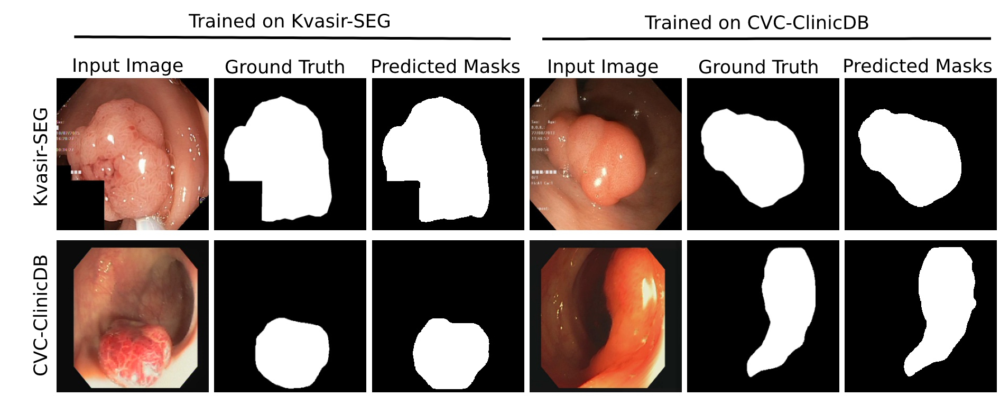

# GMSRF-Net: An improved generalizability with global multi-scale residual fusion network for polyp segmentation
This repository provides code for our paper "MSRF-Net: A Multi-Scale Residual Fusion Network for Biomedical Image Segmentation" accepted for Publication at International Conference on Pattern Recognition, 2022 ([arxiv version](https://arxiv.org/abs/2105.07451))
## 2.) Overview
### 2.1.)Introduction
Our GMSRF-Net uses a densely connected multi-scale fusion mechanism that fuses features from all resolution scales at once. The fusion of multi-scale features occurs at each convolutional layer of the densely connected structure which further increases the frequency of fusion operation while maintaining global multi-scale context throughout the process. Additionally, we design a novel cross multi-scale attention (CMSA) mechanism. These attention maps formed by the aggregation of multi-scale context boost the feature map representations in all resolution scales. Our multi-scale feature selection (MSFS) module, applies channel-wise attention on the features fused from all scales to further amplify the relevant features. Experiments demonstrate the improved generalizability of the proposed approach compared to former state-of-the-art (SOTA) methods. Thus, our GMSRF-Net opens new avenues to enhance the generalization capacity of CNN-based supervised learning approaches.

## 2.2.) Architecture of Cross Multi-Scale Attention

## 2.3.) Complete Architecture of GMSRF-Net(left) and the the global multi-scale fusion technique used(right).


## 2.4.) Qualitative Results


## 3.) Training and Testing
## 3.1)Data Preparation for Training
1.) make directory named "data/cvc_data" and "data/kvasir_data"

2.) make three sub-directories "train" "val" "test"

3.) Put images under directory named "image"

4.) Put masks under directory named "mask"

5.) Download the CVC-ColonDB and ETIS-LaribPolypDB dataset and put it in the data directory

## 3.2)Training
Model architecture is defined in `model.py`
Run the script as:
`python gmsrf_train.py`

## 3.2)Testing
For testing the trained model run:
`python gmsrf_test.py`

## 4.) Citation
Please cite our paper if you find the work useful:

```
@article{srivastava2021gmsrf,
  title={GMSRF-Net: An improved generalizability with global multi-scale residual fusion network for polyp segmentation},
  author={Srivastava, Abhishek and Chanda, Sukalpa and Jha, Debesh and Pal, Umapada and Ali, Sharib},
  journal={arXiv preprint arXiv:2111.10614},
  year={2021}
}

```
## 5.) FAQ
Please feel free to contact me if you need any advice or guidance in using this work ([E-mail](abhisheksrivastava2397@gmail.com)) 


